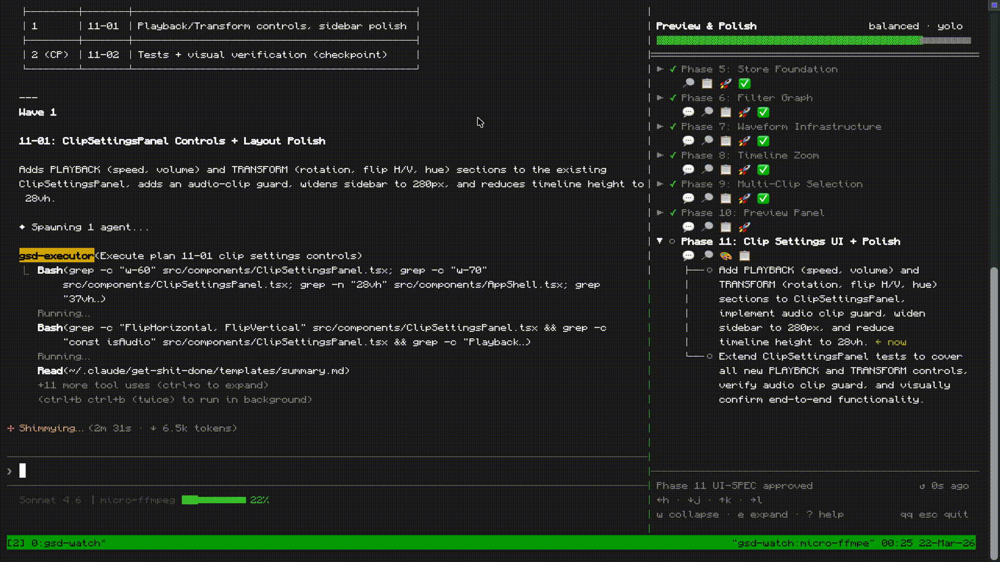

# gsd-watch

> Live GSD project status sidebar for Claude Code — in your terminal, always visible.


<p align="center">
  
</p>

<p align="center">
  <sub>Demo is sped up and has some minutes cut for convenience. Recorded on a real <a href="https://github.com/sudokku/micro-ffmpeg">micro-ffmpeg</a> project session.</sub>
</p>

A read-only tmux sidebar that renders your [GSD](https://github.com/gsd-build/get-shit-done) project tree live — phases, plans, status icons, and lifecycle badges — updating within a second of any file change. Sits alongside Claude Code so you always know where you are without switching context.

---

## Requirements

- **macOS** (darwin/arm64 or darwin/amd64)
- **tmux** — `brew install tmux`
- **Claude Code** running inside a tmux session
- **GSD v1** project with a `.planning/` directory

---

## Installation

**Option A — Download binary (recommended, no Go required):**

```bash
# Apple Silicon (M1/M2/M3/M4)
curl -L https://github.com/sudokku/gsd-watch/releases/latest/download/gsd-watch-darwin-arm64 \
  -o ~/.local/bin/gsd-watch && chmod +x ~/.local/bin/gsd-watch

# Intel Mac
curl -L https://github.com/sudokku/gsd-watch/releases/latest/download/gsd-watch-darwin-amd64 \
  -o ~/.local/bin/gsd-watch && chmod +x ~/.local/bin/gsd-watch
```

Make sure `~/.local/bin` is on your `$PATH`. Add this to your shell profile if needed:

```bash
export PATH="$HOME/.local/bin:$PATH"
```

Then install the `/gsd-watch` slash command into Claude Code:

```bash
mkdir -p ~/.claude/commands
curl -L https://raw.githubusercontent.com/sudokku/gsd-watch/main/commands/gsd-watch.md \
  -o ~/.claude/commands/gsd-watch.md
```

**Option B — Build from source:**

```bash
git clone https://github.com/sudokku/gsd-watch.git
cd gsd-watch
make all   # builds + installs to ~/.local/bin/gsd-watch
```

Then install the `/gsd-watch` slash command into Claude Code:

```bash
make plugin-install-global   # available in all projects (recommended)
make plugin-install-local    # available in current project only
```

---

## Usage

Inside a Claude Code session running in tmux, run:

```
/gsd-watch
```

This opens a 35%-width right-side pane running gsd-watch for your current project. Focus stays on the Claude Code pane. The sidebar updates automatically as GSD phases progress — no manual refresh needed.

### Keyboard shortcuts

| Key | Action |
|-----|--------|
| `j` / `↓` | Move down |
| `k` / `↑` | Move up |
| `l` / `→` | Expand phase |
| `h` / `←` | Collapse phase |
| `e` | Expand all |
| `w` | Collapse all |
| `?` | Help overlay |
| `qq` / `Esc Esc` | Quit |
| `Ctrl+C` | Force quit |

### Phase lifecycle badges

Badges appear under each phase when the corresponding GSD lifecycle file exists in the phase directory:

| Badge | Stage | File |
|-------|-------|------|
| 💬 | Discussed | `NN-CONTEXT.md` |
| 🔎 | Researched | `NN-RESEARCH.md` |
| 🎨 | UI Spec | `NN-UI-SPEC.md` |
| 📋 | Planned | `NN-01-PLAN.md` |
| 🚀 | Executed | `NN-01-SUMMARY.md` |
| ✅ | Verified | `NN-VERIFICATION.md` |
| 🧪 | UAT | `NN-HUMAN-UAT.md` |

---

## How it works

gsd-watch watches `.planning/` with fsnotify (recursive, debounced at 300ms) and re-renders on any file change — so the tree is always current without polling.

---

## Building

```bash
make build    # build/gsd-watch-arm64 + build/gsd-watch-amd64
make install  # copy arch-appropriate binary to ~/.local/bin
make clean    # remove build/
```

Static binary, no CGO, no runtime dependencies except tmux. Built with [Bubble Tea](https://github.com/charmbracelet/bubbletea).

> **macOS Sequoia note:** binaries must be signed or macOS will kill them at launch. `make build` handles this automatically via `codesign --sign -` (ad-hoc signature). Binaries downloaded from GitHub releases are pre-signed.

---

## Contributing

Bugs, feature ideas, and workflow suggestions are all welcome — open a GitHub issue. Especially interested in hearing how other GSD users are using it and what would make it more useful day-to-day.

---

MIT License
